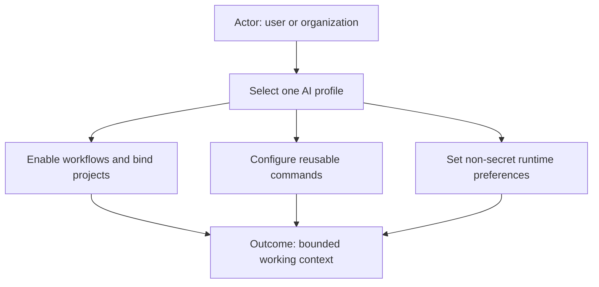
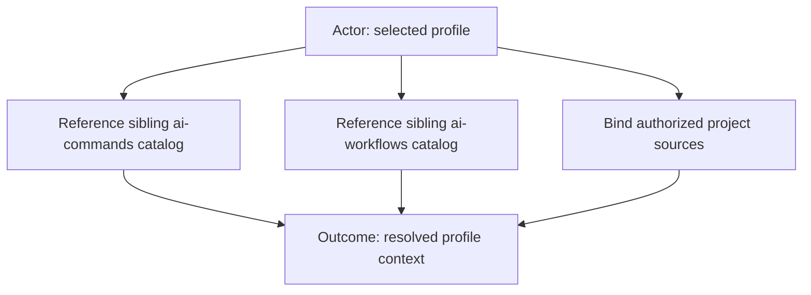

# AI Profile



AI profiles are organization-specific or personal configuration bundles for the
AI Workflow Suite. Reusable commands and workflows remain profile-agnostic; a
selected profile supplies the projects, integrations, policies, and runtime
preferences needed for one working context.

This repository contains only a sanitized, copyable
[`example`](example/example-work-profile.yml). Real profiles should live in
private repositories or local configuration because they commonly contain
organization names, internal repository coordinates, service URLs, and policy.
Credentials and secret values must never be committed.

## Repository relationship



Local installations may keep `ai-profile/`, `ai-commands/`, and
`ai-workflows/` as sibling folders. The example uses relative catalog roots
based on that layout. A profile references commands and workflows; it does not
copy their implementations or redefine their behavior.

## Profile shape

```text
<profile-id>/
├── <profile-id>-work-profile.yml
├── commands/       # Profile-wide command configuration
├── workflows/      # Workflow-scoped policy and templates
├── projects/       # Project definitions and supplemental knowledge
└── .creds/         # Local credentials; ignored and never committed
```

The work-profile entry point selects workflows and command bindings. Project
definitions provide paths, expected remotes, and optional knowledge. Overrides
belong at the narrowest owning scope and may only use extension points declared
by the referenced command or workflow.

## Use the example

1. Copy `example/` to a new private `<profile-id>/` folder.
2. Rename `example-work-profile.yml` to `<profile-id>-work-profile.yml`.
3. Replace every `/absolute/path`, `.invalid`, `example`, `EXAMPLE`, and TODO
   placeholder.
4. Remove commands, workflows, and projects that are not registered in your
   sibling catalogs.
5. Copy `identity.example.config` to the ignored `identity.config` file and set
   the intended Git identity.
6. Run `./validate-example.sh` before using or publishing the profile.

## Security boundary

Profiles may describe credential requirements but never contain tokens,
passwords, private keys, cookies, or populated credential files. Keep secrets
under ignored `.creds/` folders or in the credential store required by the
selected provider. Supplemental knowledge must also remain secret-free and
cannot grant capabilities that the selected workflow does not already allow.

## License

[MIT](LICENSE)
